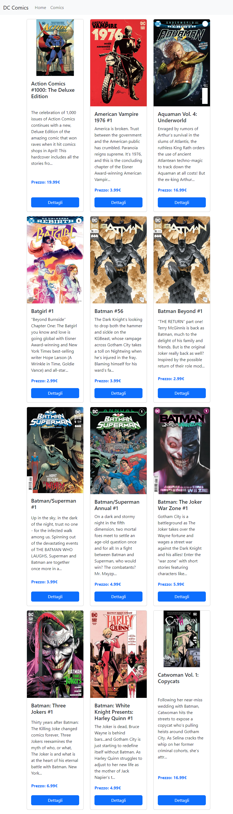

> Esercizio Laravel DC Comics

## oggi create un nuovo progetto Laravel 10 per gestire un archivio di fumetti.

- DESCRIZIONE:
  - Ciao ragazzi,oggi create un nuovo progetto Laravel 10 per gestire un archivio di fumetti.

- MILESTONE 1 :
  -  Tramite gli appositi comandi artisan create un model con relativa migration e un resource controller.

- MILESTONE 2 :
  -  Iniziate a definire le prime operazioni CRUD con le relative view:
    - index()
    - show()
    - create()
    - store()

- BONUS
  - creare il seeder per la tabella comics utilizzando il file in allegato.

## Tecnologie

- HTML
- CSS
- JAVASCRIPT
- TAILWIND CSS / SASS / BOOTSTRAP 
- VUE JS
- AXIOS
- LARAVEL
- Git e Github